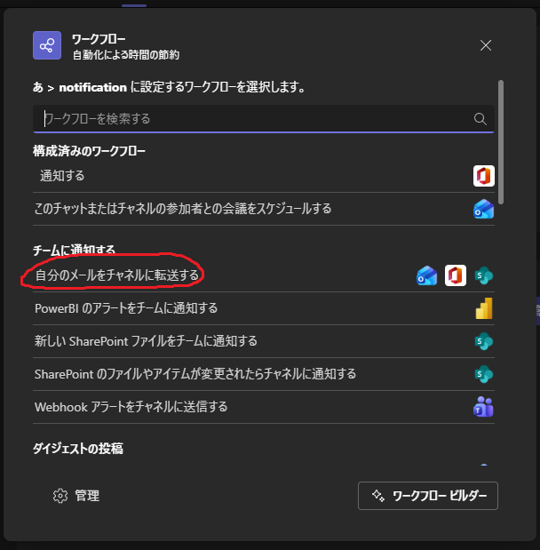
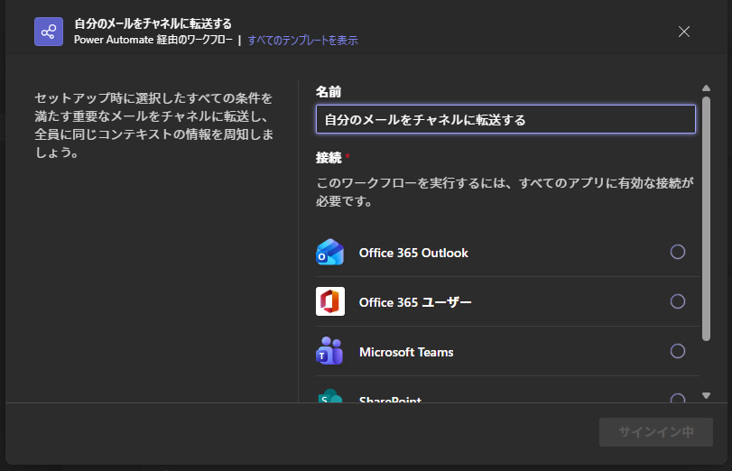
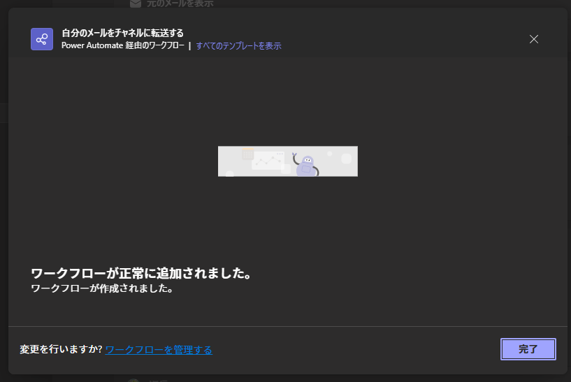
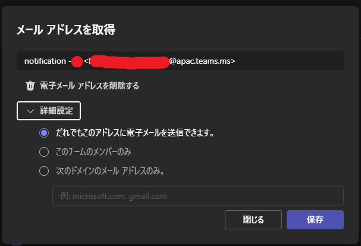
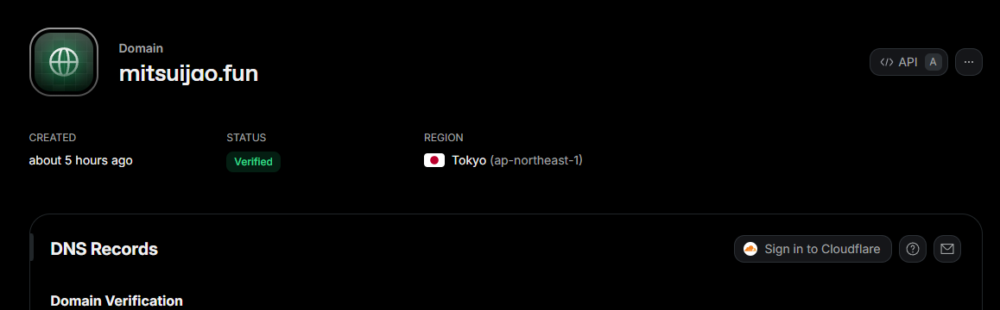

## overview

**AIと作成**

WebClassから取得した課題を任意のTeamsチャネルで通知します。
主に高専の人向け

1. WebClassスクレイピングで課題を取得 & Microsoftアカウントログイン
2. 整形してResendからメールを送信
3. teamsに通知が行く

簡単にこんな流れです。

## env
- Ubuntu 22.04.5 LTS
- Node v22.15.0
    - pupperteer 24.34.0
    - resend 6.7.0


## setup
0. ワークフローの作成
1. チャネルのメールアドレス取得
2. ドメインの取得
3. Resendに登録
4. 環境構築
5. Microsoftログイン

0が結構くせもので、Microsoftは組織が強いのでもしかしたら登録できない可能性は高いです。高専機構ではいけるかも

あと5は必ずMFAコードを用いたログイン形式にしておくこと


### 0.ワークフローの作成
送りたいチャネルの右にある3つの点 > ワークフロー


\> 自分のメールをチャネルに転送する



\> 次へ （ここちょっと時間かかる） 



チームとチャネル適当に選択して ワークフローを追加する


ここまで来たらオッケー




組織で制限されてたらこのワークフロー作れないからそうなったら諦める。


### 1.メールアドレスの作成

最初の画像のところにあるメールアドレスを取得、< >で囲われたメールアドレスをコピーしておく

詳細から一応ドメインから絞れるけど一旦「だれでも」にしとく



### 2.ドメインの取得

このプロジェクトではプログラムからAPIを通してメール送るので独自ドメインから送信した方が楽です

GmailやoutlookとかのドメインからはOAUTHなどでAPIが複雑になりそうです。あとドメインのほうがかっこいい

どこでもいいですが、cloudflareから取るのが安くておすすめです

### 3.Resendに登録

さっきからResend言ってますが、主に開発者のためのメール配信APIのことです。
コードを数行書くだけでメールが送信できます。

https://resend.com/

サインアップした後、ドメインも登録します。ここでは説明しません。

もしDNSをcloudflare使っているのであれば簡単にDNSに登録することができます。
右にあるSign in to Cloudflareをクリックしてログインするだけです。

**必ずDMARCも登録する必要があります！** 

忘れずに手動で登録します



DMARCを登録しないと普通迷惑メールに振り分けられるようで、その場合は正常に通知されません

### 4.環境構築

このリポジトリをクローンします

そしたらnode環境を整えます
```bash
npm install
```

.envの作成
```bash
cat << EOF > .env
USER_ID='{your_ID}'
PASSWORD='{your_password}'
APIKEY='{Resend_APIKEY}'
SENDFROM='notification@{your_domain}'
SENDTO='{channel_mailaddress}'
EOF
```

.envに以下を設定します
```
USER_ID='{your_ID}'
PASSWORD='{your_password}'
APIKEY="{Resend_APIKEY}"
SENDFROM="notification@{your_domain}"
SENDTO="{channel_mailaddress}"
```

| .env     | 用途                                                       | 
| -------- | ---------------------------------------------------------- | 
| USER_ID  | Microsoftアカウントのメールアドレス                        | 
| PASSWORD | Microsoftアカウントのパスワード                            | 
| APIKEY   | ResendのAPIKEY                                             | 
| SENDFROM | ドメインのメールアドレス | 
| SENDTO   | チャネルのメールアドレス                                   | 

SENDFROMのnotificationの部分はなんでもいいです


### 5.Microsoftログイン

このプロジェクトではMFAアプリでのコード入力をデフォルトでサポートしています
もし電話とかonedriveとかアプリ認証にしている場合は変更します

初回実行は`src/scraper.js`を実行します

```bash
node src/scraper.js
```

しばらくするとMFAコードの入力が求められます
Code: が表示されたら、Google Authenticatorなどで生成されたコードを入力してください。

```
.....
Waiting for email input...
Waiting for password input...
Waiting for authentication challenge...
TOTP (Google Authenticator) detected.
Code: 562860
Entering confirmation code: 562860
Waiting for final redirection to WebClass...
.....
```

ルートに`cookies.json`ができたことを確認してください
これでWebClassに通常のログインが完了し、そのcookieが保存されます


次回からは
```
node index.js
```
を実行します。cronで5分間隔とかに設定しておきます。


`index.js`を実行時にログインセッションが切れたら.envの` `のほうにメールが行きます
するとまた`scraper.js`を実行してcookieを更新します


## contact
`22126@yonago.kosen-ac.jp`